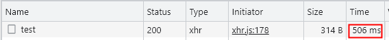

## 参数说明 - delay （请求返回时长）
> ⚠️注意：由于返回数据需要进行一系列处理、及网络原因，请求时长可以会 >= delay

>当前请求地址：http://localhost:6601/mock-middleware/yapiMockApi/test

- ### 使用场景 - 用于修改请求返回时长，测试弱网情况

`本地mock配置：`

```
  'POST /mock-middleware/yapiMockApi/test': {
    delay: 500, // default is 100
  },
```

`效果：`


