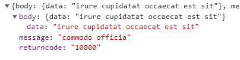
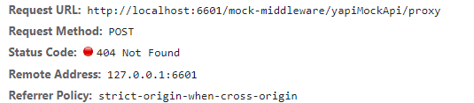
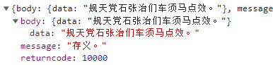

## 参数说明 - disabled （是否禁用mock）

[comment]: <> ([示例]&#40;http://localhost:6601/mocker/example/?type=7&#41;)

>当前请求地址：http://localhost:6601/mock-middleware/yapiMockApi/proxy

`基于yapi生成的mock数据：`



- ### 使用场景 - 有yapi接口，不使用基于yapi生成的mock数据
   `本地mock配置：`

   ```
   'POST /mock-middleware/yapiMockApi/proxy': {
      disabled: true, // default is false
   }
   ```

   `效果1：` `config未配置proxy`

   

   `效果2：` `config已配置proxy`
   >实际请求地址为：http://api.openeagle.cn/mock/1249/yapiMockApi/proxy

   

