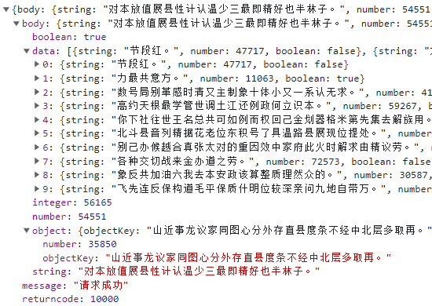
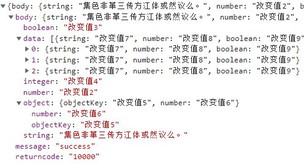
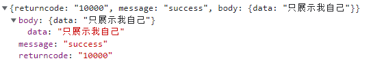

## 参数说明 - mergeable （是否合并yapi生成的mock数据）

>当前请求地址：http://localhost:6601/mock-middleware/yapiMockApi/test

`基于yapi生成的mock数据：`



- ### 使用场景1 - 有yapi接口，需要覆盖改动部分数据

[comment]: <> ([示例1]&#40;http://localhost:6601/mocker/example/?type=2&#41;)

`本地mock配置：`

```
'POST /mock-middleware/yapiMockApi/test': {
  mergeable: true, // default is true
  tesing: 'res',
  testcase: {
    res: {
      returncode: '10000',
      message: 'success',
      body: {
        // string: 该值不覆盖，自动使用基于yapi生成的mock数据,
        number: '改变值2',
        boolean: '改变值3',
        integer: '改变值4',
        object: {
          objectKey: '改变值5',
          number: '改变值6',
        },
        'data|3': [
          {
            string: '改变值7',
            number: '改变值8',
            boolean: '改变值9',
          },
        ],
      },
    },
  },
}
```

`效果：`




- ### 使用场景2 - 有yapi接口，需要覆盖所有数据

[comment]: <> ([示例2]&#40;http://localhost:6601/mocker/example/?type=3&#41;)

`本地mock配置：`

```
'POST /mock-middleware/yapiMockApi/test': {
  mergeable: false, // default is true
  tesing: 'res',
  testcase: {
    res: {
      returncode: '10000',
      message: 'success',
      body: {
        data: '只展示我自己'
      },
    },
  },
}
```

`效果：`


