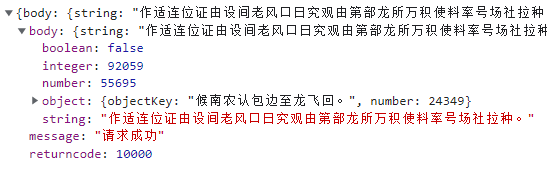
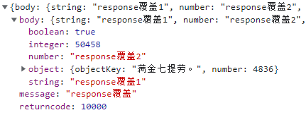

## 参数说明 - response （用于合并覆盖当前接口返回的数据）

[comment]: <> ([示例]&#40;http://localhost:6601/mocker/example/?type=7&#41;)

>当前请求地址：http://localhost:6601/mock-middleware/yapiMockApi/response

`未覆盖前`




- ### 使用场景 - 基于yapi生成的mock数据不满足需求，需要手动修改返回数据

`本地mock配置：`

```
'POST /mock-middleware/yapiMockApi/response': {
  response: {
    message: 'response覆盖',
    body: {
      string: 'response覆盖1',
      number: 'response覆盖2',
    },
  },
}
```

`效果：`


