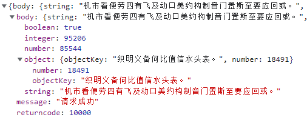
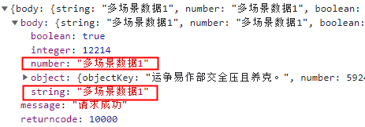
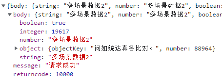
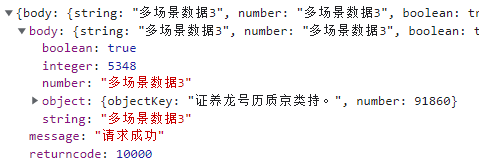
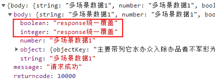
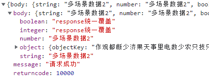
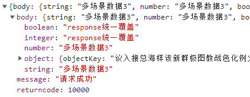

## 参数说明 - tesing | testcase（合并覆盖当前接口返回的数据-多场景）

- ### 对比：正常的mock
只支持单一场景。我们配置好了一组数据，配置第二组数据时会将前者覆盖，第三、四。。。也是这时已经无法得知第一组数据是什么了，别人要想回归测试的时就有点艰难了~~

- ### tesing | testcase 功能
多场景。使用testcase配置好多个场景数据后，由tesing指定某个场景

------


- ### 使用场景 - 一个接口有多个场景需要测试，以切换使用不同的数据

>当前请求地址：http://localhost:6601/mock-middleware/yapiMockApi/testcase

`基于yapi生成的mock数据：`



`本地mock配置：`

```
'POST /mock-middleware/yapiMockApi/testcase': {
  tesing: 'res1',
  testcase: {
    res1: {
      body: {
        string: '多场景数据1',
        number: '多场景数据1',
      },
    },
    res2: {
      body: {
        string: '多场景数据2',
        number: '多场景数据2',
      },
    },
    res3: {
      body: {
        string: '多场景数据3',
        number: '多场景数据3',
      },
    },
  },
}
```

1. `效果： tesing=res1 `



2. `效果： tesing=res2 `



3. `效果： tesing=res3 `




- ### 进阶 - 多个场景数据需要是覆盖同一个值，不想每个场景逐个去加
> 配置response使用

`本地mock配置：`

```
'POST /mock-middleware/yapiMockApi/testcase_response': {
  response: {
    body: {
      boolean: 'response统一覆盖',
      integer: 'response统一覆盖',
    },
  },
  tesing: 'res3',
  testcase: {
    res1: {
      body: {
        string: '多场景数据1',
        number: '多场景数据1',
      },
    },
    res2: {
      body: {
        string: '多场景数据2',
        number: '多场景数据2',
      },
    },
    res3: {
      body: {
        string: '多场景数据3',
        number: '多场景数据3',
      },
    },
  },
}
```

1. `效果： tesing=res1 `



2. `效果： tesing=res2 `



4. `效果： tesing=res3 `


